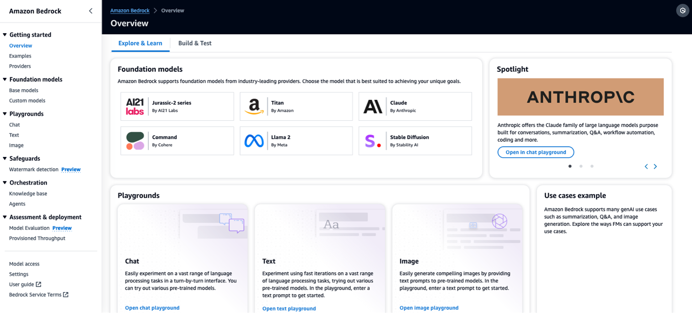
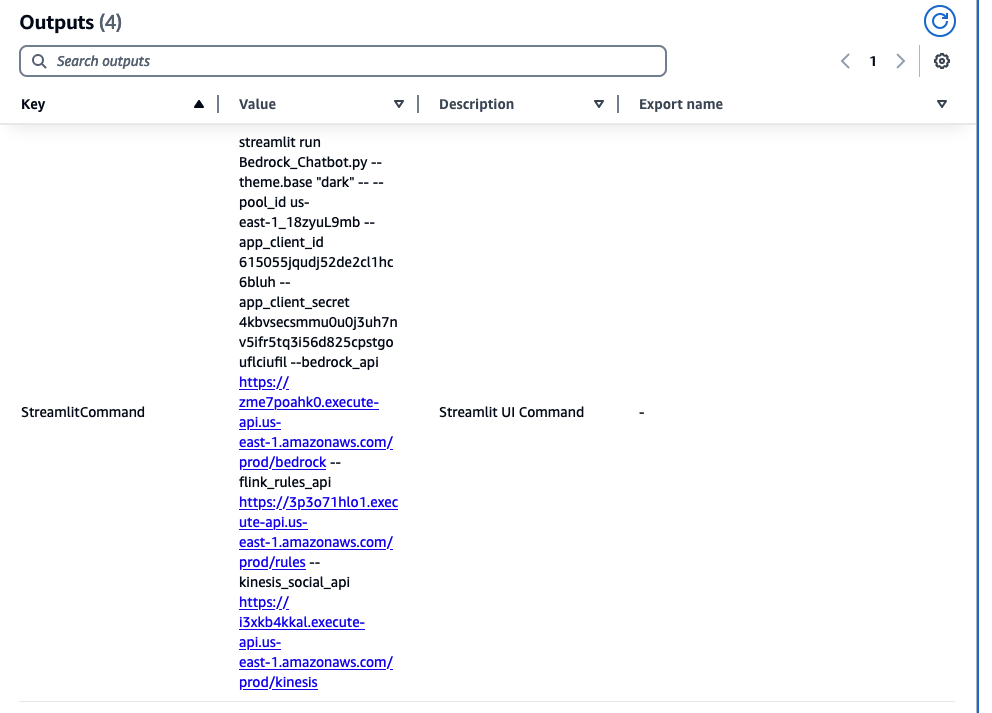

# Uncover Social Media Insights in Real Time using Amazon Managed Service for Apache Flink and Amazon Bedrock

In this AWS Sample you will deploy an AWS Architecure that is able to combine streaming data with GenAI using Amazon Managed Service for Apache Flink and Amazon Bedrock

## Architecture


## Solution Description

1.	User logs in using Amazon Cognito User. Cognito will be used to authenticate all API Gateway Calls
2.  User inputs using the front-end application, hosted locally developed using Streamlit framework, the query terms, API Key and frequency of requests to be made to the X - Twitter API in a Streamlit front end UI. We also provide a front-end of a Kinesis Social Media Application where you can also send messages to be processed in case of not having a Twitter Developer Account
2.	Amazon Managed Service for Apache Flink is used to consume and process the tweets in real time and stores in state the parameters for making the API requests received from the front-end application
3.	The streaming application using Flink’s Asynchronous Async I/O invokes Amazon Titan Embeddings Model hosted by Amazon Bedrock to embed the tweets.
4.	Amazon Bedrock responds with the embeddings of the tweets
5.	The Apache Flink application then writes the embeddings and original text of the message into an Amazon OpenSearch Index. We will be using two separate indexes to separate the messages coming from the X source, and the messages being ingested from the Kinesis Social Media App
6.	User makes questions using the front-end application in Streamlit
7.	An AWS Lambda Function is triggered by Amazon API Gateway with the query from the user.
8.	The Lambda function using LangChain, invokes Amazon Titan Embeddings model to embed the question
9.	Amazon Bedrock returns the embedded question
10.	The Lambda function using LangChain, does a semantic search in Amazon OpenSearch and retrieves the relevant documents related to the question.
11.	Amazon Opensearch returns to the AWS Lambda function, the relevant documents with the vectors for answering the question.
12.	The Lambda Function using LangChain, Prompt Engineering, provides the question and relevant vectors for answering the question to Anthropic Claude Model hosted by Amazon Bedrock
13.	Amazon Bedrock returns the answer to the question to the Lambda function
14.	The response is delivered to API Gateway
15.	API Gateway provides the response to the questions of the user in the Streamlit application

## Getting started

### Pre-requisites

To implement this AWS Sample, you need to have the following in your local environment:

-	If you want to pull data from X (Twitter), you will need a Twitter Developer Account with at least Basic Tier, in order to use the Search Tweet API. If not, you will be able to process custom messages you send through an UI
-	Download Python 3.11.9 or later
-   Download and install Node.js 14.15.0 or later
-	Download and install Typescript 3.8 or later 
  `npm install -g typescript`
-	Download and install Git
-	Download and install AWS CDK CLI
  `npm install -g aws-cdk`
-	Download and install Maven 
-	Download and install Streamlit
  `pip install streamlit==1.30.0`
-   Download CognitoAuthenticator
  `pip install streamlit-cognito-auth`

You will also need to request GenAI Models access for Amazon Titan Embeddings Model and Anthropic Claude Foundation Models in Amazon Bedrock

Follow the instructions in order to request the models:


1.	Go to the Amazon Bedrock Console, by searching Bedrock, and click on the service


2.	Click Get Started


3.	Go to Model Access in the bottom left Menu



4.	Click Manage model access


5.	Select within Amazon
a.	Titan Embeddings G1 – Text
6.	Select within Anthropic
a.	Claude Instant


7.	Go to the bottom and click Request model access


8.	It may take several minutes to get access to the models, but we can continue with the solution deployment


### Use CDK to create and deploy the solution stack

We use AWS CDK CLI to deploy the Solution. The CDK will deploy the following:
-   Amazon Cognito User Pool, App Client and User
-	Kinesis Data Streams for receiving rules for pulling data from Twitter API
-	Kinesis Data Streams for receiving user generated messages from StreamLit Application
-	Amazon API Gateway to send events to Rules Kinesis Data Streams
-	Amazon API Gateway to send custom messages to Kinesis Data Streams
-	Amazon OpenSearch for Vector Database
-   AWS Lambda Function for creating indexes in Amazon OpenSearch
-	AWS Lambda Function with LangChain for invoking Amazon Bedrock and do semantic Search in Opensearch
-	Amazon API Gateway for invoking the Lambda Function.
-	Amazon Managed Service for Apache Flink, for processing the tweets and invoking Amazon Bedrock to do the Embeddings.
-   AWS Lambda to start Managed Flink Application

1. Git Clone the repository

```shell
git clone <repo>
```

1. CD into repo

```shell
cd real-time-social-media-analytics-with-generative-ai
```

3. Install libraries

```shell
npm install
```

4. CD into the Apache Flink Application folder

```shell
cd flink-bedrock
```

5. Build the Apache Flink Application

```shell
mvn clean package
```

6. Go back to the root folder of the directory

```shell
cd ..
```

7. Bootstrap your AWS environment
```shell
cdk bootstrap
```
8. Deploy the AWS Architecture
```shell
cdk deploy
```
9. When asked answer yes to confirm the deployment. The deployment will take around 10 minutes.
10.	After deployment has finished, please go to AWS CloudFormation


11.	Go to Stacks
12.	Select RealTimeSocialMediaAnalyticsGenAi
13.	Go to Outputs
14.	You will need to copy the **StreamlitCommand**, which we will use for later



As part of the deployment, two AWS Lambda Functions have been created and deployed in order to start the Managed Flink Application and create the two indexes in OpenSearch
The two indexes are:

```
PUT /twitter-custom-rag-index
{
  "mappings": {
    "properties": {
      "embeddings": {
        "type": "knn_vector",
        "dimension": 1536,
        "method": {
          "name": "hnsw",
          "space_type": "l2",
          "engine": "nmslib",
          "parameters": {
            "ef_construction": 128,
            "m": 24
          }
        }
      },
      "@timestamp": {
        "type": "date"
      },
      "text": {
        "type": "text"
      }
    }
  },
  "settings": {
    "index": {
      "knn": true,
      "number_of_shards": "5",
      "number_of_replicas": "1"
    }
  }
}
```

```
PUT /twitter-rag-index
{
  "aliases": {},
  "mappings": {
    "properties": {
      "@timestamp": {
        "type": "date"
      },
      "embeddings": {
        "type": "knn_vector",
        "dimension": 1536,
        "method": {
          "engine": "nmslib",
          "space_type": "l2",
          "name": "hnsw",
          "parameters": {
            "ef_construction": 128,
            "m": 24
          }
        }
      },
      "impression_count": {
        "type": "integer"
      },
      "likes": {
        "type": "integer"
      },
      "retweet_count": {
        "type": "integer"
      },
      "tweet": {
        "type": "text"
      }
    }
  },
  "settings": {
    "index": {
      "knn": true,
      "number_of_shards": "5",
      "number_of_replicas": "1"
    }
  }
}
```

With these steps we have configured the Data Ingestion part of the solution, we will now continue in setting up the User Interface.

### Streamlit Application

1. In the project repository, cd into the streamlit folder

```shell
cd streamlit
```

In that folder you will find a Multi-Page Streamlit Application
-	One for configuring the Flink Application for filtering the tweets to process
-	Another for sending custom messages if you do not have a Twitter Developer Account.
2. We will start the Streamlit Application UI, for which you will need to use the command you copied from the CloudFormation Outputs

It follows this pattern
```shell
streamlit run Bedrock_Chatbot.py --theme.base "dark" -- --pool_id <pool_id> --app_client_id <app_client_id> --app_client_secret <app_client_secret>  --bedrockApi <value> --rulesApi <value> --kinesisAPI <value>
```

This will open a tab in your browser. This is how we will be able to interact with our Flink Application and make questions related to the processed messages

4. You will need to authenticate with the Cognito user that has been created during the CDK Deployment

* Username: FlinkGenAIBedrock@example.com,
* Password: FlinkGenAIBedrock2024!

> You can create additional users in Amazon Cognito and delete this one if needed


3. If you are going to be using the Twitter API you will need to provide the following:

- Twitter Bearer Token
- Query term for the Search API (For ex. Amazon Bedrock)
- Time between requests (Basic Tier of Twitter API only allows us to pull data every 15 seconds with a maximum of 10000 Tweets per month). If you select a frequency below 15 seconds it won’t accept the input as we don’t want the API to be throttled. This can be modified in the Flink Application Code.


4. Once you have entered those configurations, we are ready to start making questions related to Twitter Feed.  Please check the Use Twitter Index Box. If we don’t, we will be making questions to the Kinesis Social Media messages

For example, we will make the following questions

•	Based on the tweets, what are the main topics people are discussing?


•	Which are the most asked product feature requests in AWS?


5. If you do not plan to use the Twitter API, you send messages using the My Social Media. For example:


If we go back to Bedrock Chatbot, we can make questions on messages we sent to My Social Media. Note “Use Twitter Index” box must be unchecked.

•	Is there any tweet mentioning Mistral?


Feel free to continue sending messages to the Kinesis Social Media, or pulling data from X, however beware you don’t know over your monthly threshold of the API requests

## Clean up

To delete all created stack resources you can run

```shell
cdk destroy --all
```

## License

This library is licensed under the MIT-0 License. See the LICENSE file.


## Disclaimer

In this sample, if you are going to consume data from Twitter using a developer account, you will be interacting with public data coming from the feed. This sample takes no responsibility of the comments or opinions that could be consumed from the social media application

This sample is meant to be treated as an example use case where real time embeddings and RAG could add business value to analyze social media. It is not meant for production, however if needed you can leverage [CDK Nag](https://github.com/cdklabs/cdk-nag) in order to identify best practices for all the services deployed in the sample.